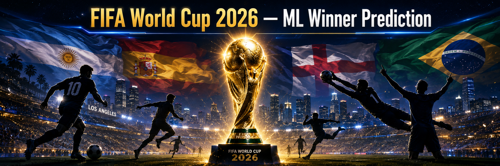

# FIFA World Cup 2026 — ML Winner Prediction


# ⚽ FIFA World Cup 2026 — ML Winner Prediction

A machine learning project that predicts the FIFA World Cup 2026 winner using match-by-match simulation powered by XGBoost and Monte Carlo methods.

🔴 **Live dashboard:** https://worldcup2026-ml-predictor.streamlit.app

---

## Tournament Results

The 2026 FIFA World Cup is over. **Spain won the tournament**, defeating Argentina in the Final. The model had predicted Argentina as the winner.

### Model Accuracy by Round

| Round | Correct | Total | Accuracy |
|-------|---------|-------|----------|
| Round of 32 | 11 | 16 | 68.8% |
| Round of 16 | 6 | 8 | 75.0% |
| Quarter-Finals | 3 | 4 | 75.0% |
| Semi-Finals | 1 | 2 | 50.0% |
| Third Place | 0 | 1 | 0.0% |
| Final | 0 | 1 | 0.0% |
| **Overall** | **21** | **32** | **65.6%** |

### Key Upsets the Model Missed

- **Round of 32:** Brazil beat Japan · Morocco beat Netherlands · France beat Sweden · Portugal beat Croatia · Egypt beat Australia
- **Round of 16:** Morocco beat Canada · Belgium beat United States
- **Quarter-Finals:** England beat Norway
- **Semi-Finals:** Spain beat France
- **Final:** Spain beat Argentina

### Pre-Tournament Predictions vs Reality

| | Model Predicted | Actual |
|---|---|---|
| Winner | Argentina (33.7%) | Spain |
| Runner-up | Spain | Argentina |
| Semi-finalists | France, England | France, England ✅ |

The model correctly identified France and England as semi-finalists and got 65.6% of knockout matches right — a reasonable result given the inherent unpredictability of tournament football.

---

## How It Works

Rather than picking a single predicted winner, the model simulates the entire tournament **10,000 times**. Each match outcome is sampled probabilistically from the model's predictions, producing a full **win probability distribution** across all 48 teams. Probabilities update after each match day as real results are locked in — the simulation re-runs with completed matches as fixed outcomes while remaining matches stay probabilistic.

---

## Project Structure

```
wc2026-predictor/
│
├── assets/                               # Banner and static images
│
├── data/
│   ├── raw/                              # Original Kaggle datasets, never modified
│   └── processed/                        # Cleaned and feature-engineered outputs from notebooks
│
├── notebooks/                            # End-to-end pipeline, run in order
│
├── src/                                  # Reusable modules imported by notebooks and the app
│
├── app/                                  # Streamlit dashboard
│
├── models/                               # Saved model and feature list
│
└── README.md
```

### Folder decisions

**`data/raw/`** — original Kaggle CSVs, never touched after download. Single source of truth.

**`data/processed/`** — outputs from each notebook stage: cleaned dataframes, merged feature matrices, simulation-ready inputs, bracket positions, and the live results file updated after each match day.

**`notebooks/`** — the full ML pipeline broken into sequential steps. Each notebook reads from `data/processed/` and writes its outputs back there, so any stage can be rerun independently.

**`src/`** — reusable logic extracted from notebooks into standalone modules, shared by both the simulation notebook and the Streamlit app.

**`app/`** — Streamlit dashboard deployed on Streamlit Community Cloud.

**`models/`** — serialized XGBoost model and feature list, loaded by the app at runtime.

---

## Datasets

| # | Dataset | Source |
|---|---------|--------|
| 1 | FIFA WC 1930–2022 All Match Dataset | [Kaggle](https://www.kaggle.com/datasets/jahaidulislam/fifa-world-cup-1930-2022-all-match-dataset) |
| 2 | 2026 WC Historical Elo Ratings | [Kaggle](https://www.kaggle.com/datasets/afonsofernandescruz/2026-fifa-world-cup-historical-elo-ratings) |
| 3 | FIFA World Cup Team Dataset | [Kaggle](https://www.kaggle.com/datasets/harrachimustapha/fifa-world-cup-team-dataset) |
| 4 | 2026 WC Match Data | [Kaggle](https://www.kaggle.com/datasets/areezvisram12/fifa-world-cup-2026-match-data-unofficial) |

---

## Features per Match

- Elo rating of each team (and the difference)
- FIFA ranking of each team
- Win rate and goals per match
- Historical Elo minimum (floor strength indicator)
- Confederation (UEFA, CONMEBOL, CONCACAF, CAF, AFC, OFC)
- Rank difference and Elo difference between teams

---

## Model

**XGBoost** binary classifier trained on historical World Cup match data filtered to the 48 qualified 2026 nations (418 matches).

- **Target:** Home Win vs No Home Win (draws resolved separately)
- **Accuracy:** 71% on held-out test set
- **Features:** 13 features selected via correlation analysis
- **Knockout draws** resolved via Elo-weighted penalty probability

---

## Monte Carlo Simulation

```
Group Stage      → Simulate all 48 group matches → rank teams → advance top 2 per group + best 8 third-place teams
Round of 32      → Simulate 16 matches → advance 32 winners
Round of 16      → Simulate 16 matches → advance 16 winners
Quarter-Finals   → Simulate 8 matches  → advance 8 winners
Semi-Finals      → Simulate 4 matches  → advance 4 winners
Third Place      → Simulate 1 match    → third place winner
Final            → Simulate 1 match    → tournament winner
```

Repeat **10,000 times**. Final win probability per team = simulations won ÷ 10,000.

The simulation follows the **official 2026 World Cup bracket** — Round of 32 matchups are determined by group positions, and the knockout path is fixed according to the official fixture.

---

## Live Updates

After each match day, real results are manually added to `data/processed/results.csv`. The simulation re-runs with completed matches locked as fixed outcomes, updating win probabilities dynamically for all remaining teams. The dashboard reflects the latest state automatically.

---

## Dashboard

The interactive Streamlit dashboard includes six views:

- **Hero** — win probabilities for all 48 teams with stage-by-stage breakdown
- **Tournament Bracket** — official 2026 bracket with predicted path and win probabilities
- **Team Profile** — per-team radar chart and stage reach probabilities
- **Monte Carlo Insights** — dark horses, biggest upsets, and probability distributions
- **Feature Importance** — XGBoost feature importance chart
- **Model Validation** — predicted vs actual results, accuracy tracking, and upset log

---

## Stack

```
pandas        Data loading and wrangling
numpy         Probability sampling
xgboost       Match outcome predictor
scikit-learn  Preprocessing and evaluation
matplotlib    Visualizations
seaborn       Visualizations
tqdm          Progress bar for simulations
streamlit     Interactive dashboard
plotly        Interactive charts
joblib        Model serialization
```

---

## Running Locally

```bash
git clone https://github.com/Speakful/wc2026-predictor.git
cd wc2026-predictor
pip install -r requirements.txt
streamlit run app/app.py
```

---

## Known Limitations

- Training set limited to 418 matches — sufficient for Elo-based features but constrains draw prediction
- Draw outcomes in group stage use a fixed base rate rather than match-specific prediction
- Model uses pre-tournament features only — in-tournament form is not dynamically recalculated

---

## Notes

- 2026 uses a new **48-team / 12-group** format for the first time in World Cup history
- The top 2 from each group + the **8 best third-place teams** advance to the Round of 32
- Training data filtered to 418 matches between currently qualified 2026 nations to ensure Elo feature coverage
- All features use only pre-tournament data to avoid data leakage
